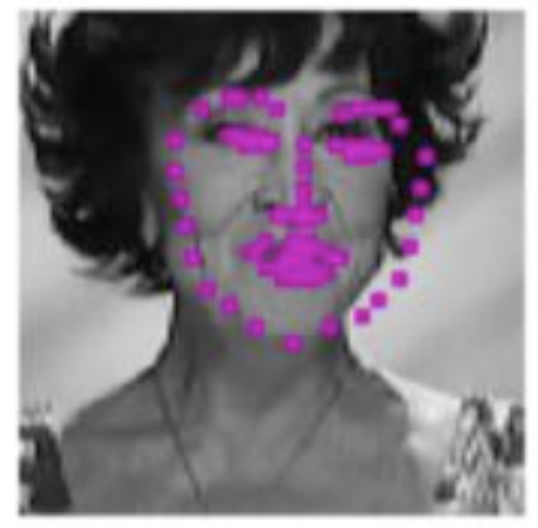
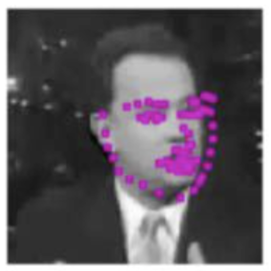
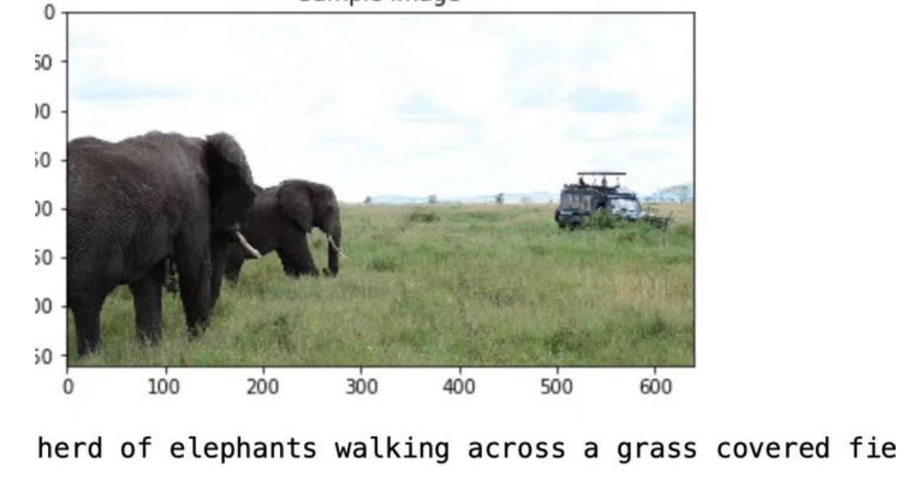
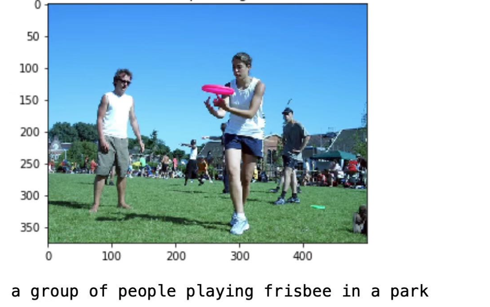
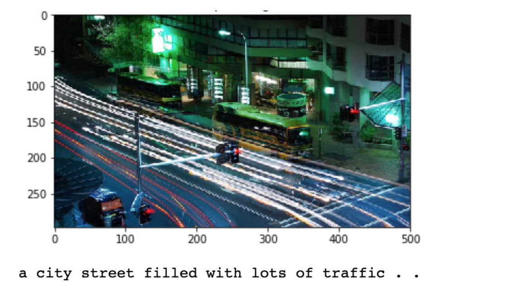
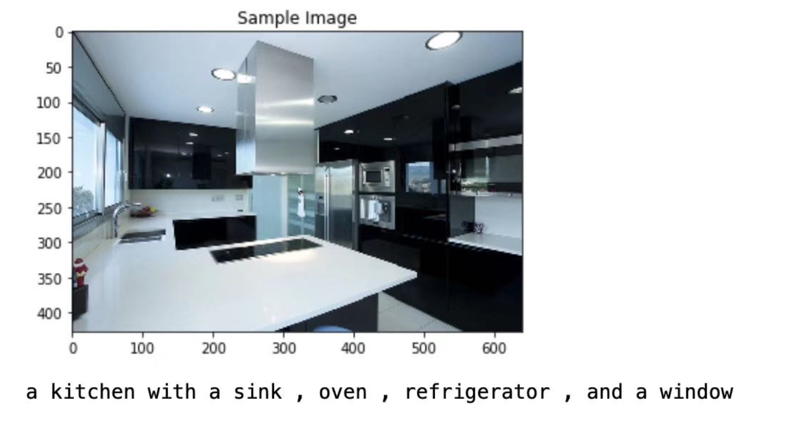

# Computer Vision Demo

* ### **Facial Feature Recognition**  
    * Detects and highlights key facial features given an image (implemented with Pytorch)
    * Trained a CNN model with AlexNet as the basic structure on YouTube Faces Dataset 
    * Some results:  
    
    

* ### **Image Captioning** 
    * Describe / auto caption a given image (implemented with Pytorch)
    * Trained an end-to-end CNN-RNN(LSTM) model with the Microsoft COCO dataset as described in the paper Neural Image Caption Generator (https://arxiv.org/pdf/1411.4555.pdf).
    * Some results: 
    
    
    
    
